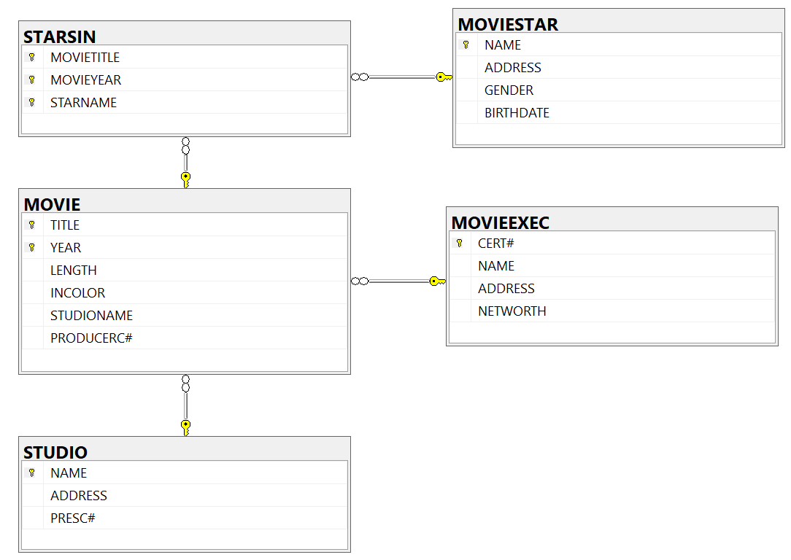
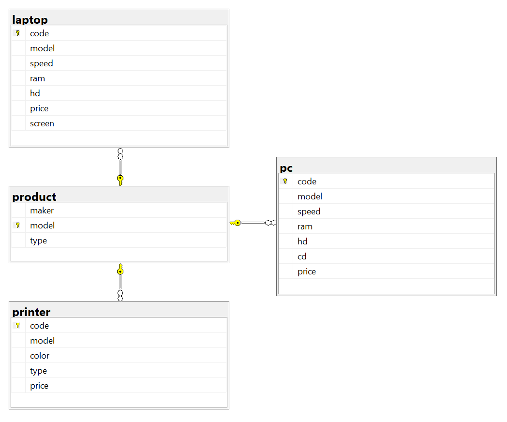
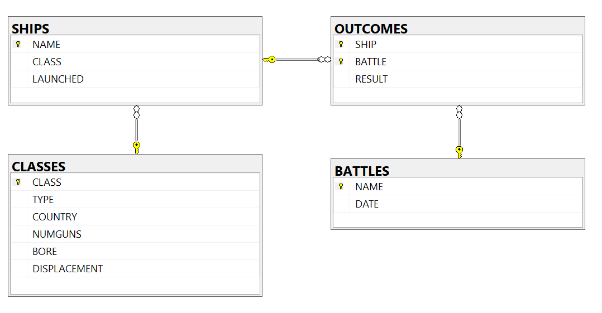

# Бази от дании - задачи

* Базата movies



* Базата pc



* Базата ships



--------------------------------------------------------------


* SELECT - извличане на данни 
* FROM - откъде извличаме данните
* OR, AND - И, ИЛИ
* WHERE - където, след него пишем условия
* IS NULL, IS NOT NULL - проверка за нулеви стойности 
* <, > - лексикографско сравняване на символни низове
* = - сравнение 
* LIKE - сравнение като =
* % - заместване на нула, един или повече символа, работи с LIKE
* _ - замества точно един символ, работи с LIKE
* ORDER BY - начина на подреждане, който връща една SELECT заявка.Сървърът подрежда резултата първо по първия признак, после по втория и т.н.  По подразбиране, подреждането става по възходящ ред, като това може и да се указва експлицитно. 
* ASC - възходящ ред
* DESC - низходящ ред


**Примери:**

 ```python
1. SELECT * FROM CLASSES
```

 ```python
2.  SELECT CLASS, COUNTRY, NUMGUNS FROM CLASSES
```

 ```python
3. SELECT TITLE, YEAR, STUDIONAME
    FROM MOVIE
    WHERE LENGTH > 60 OR TITLE = 'Titanic'
```
```python
4. SELECT TITLE, YEAR, STUDIONAME AS STUDIO
   FROM MOVIE
   WHERE LENGTH > 60 OR STUDIO = 'Disney'
```

```python
5. SELECT TITLE, YEAR, LENGTH / 60.0 AS LENGTH_IN_HOURS
   FROM MOVIE
   WHERE LENGTH > 60 OR YEAR = 2001
```
```python
6. SELECT CLASS, COUNTRY, NUMGUNS 
   FROM CLASSES
   WHERE LENGTH IS NULL
```
```python
7.  name LIKE 'a%'
```
```python
8.  SELECT TITLE, YEAR, STUDIONAME AS STUDIO
    FROM MOVIE
    WHERE TITLE LIKE '%Trek%'
```
```python
9.  SELECT CLASS, COUNTRY, NUMGUNS 
    FROM CLASSES
    WHERE NUMGUNS > 5 OR COUNTRY = 'USA'
    ORDER BY COUNTRY ASC, NUMGUNS DESC
```

